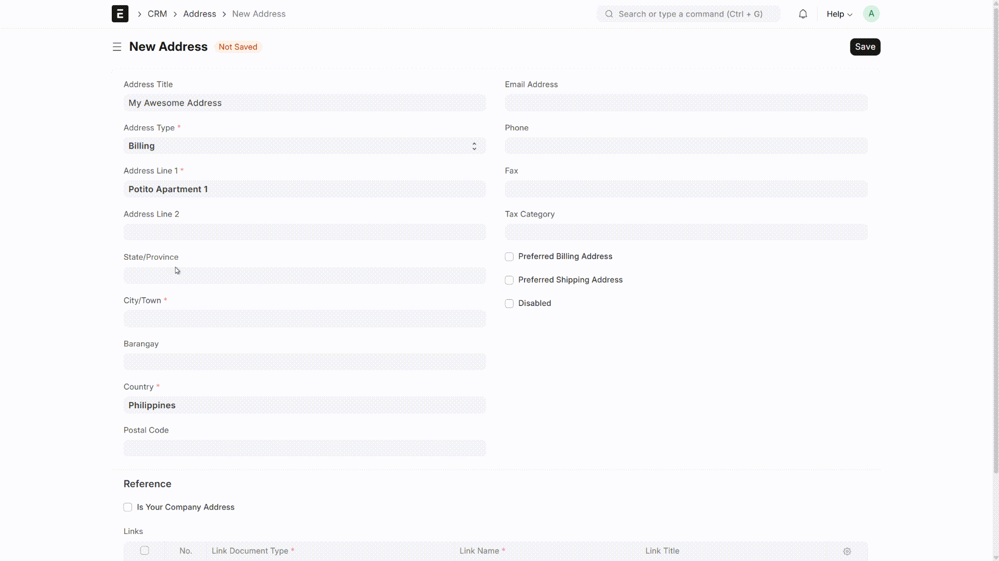

<div align="center">
  <a href="https://frappe.io">
    
  </a>

  <h1>Geo Extension</h1>
  <h4>Enhancing the Address Experience in Frappe</h4>

  

<br><br>

</div>

---

## Overview

**Geo Extension** is a lightweight **Frappe app** that enhances the frappe Geo module by improving how users encode and manage address information.  
It extends the **Address Doctype** to make primary address keys (like _State, City, and County_) filterable and interactive — turning tedious address input into a smooth, guided process.

With country-specific manifests and hierarchical data levels, users can select from real administrative divisions instead of typing free-form text, drastically reducing data entry errors.

---

## Motivation

Encoding addresses in ERPNext or any Frappe app can be repetitive and error-prone — especially for data-heavy workflows like customer registration, delivery setup, or supplier profiling.  
**Geo Extension** simplifies this process by making address encoding filtered, intuitive, and contextual.

This project was also a personal challenge: to build something useful and shareable with the **Frappe Community**, demonstrating how modular extensions can improve user experience within the framework.

---

## Key Features

- **Dynamic Address Hierarchy**  
  Automatically adapts field labels and filters (e.g., _Province → City → Barangay_) based on the selected country’s configuration.

- **Manifest-Driven Location Levels**  
  Country-specific `manifest.json` files define how address hierarchies load and map to Frappe fields.

- **Autocomplete Field Enhancement**  
  Converts static _Data_ fields (like state, city, and barangay) into **Autocomplete fields** for faster, error-free entry.

- **Flexible Fallback Behavior**  
  If no manifest exists for the selected country, the app gracefully falls back to standard Data input — keeping the form usable by default.

- **Reference Data Support**  
  Supports location datasets in CSV format with hierarchical linkage across levels (_Province → City → Barangay_).

- **Seamless Integration**  
  Works directly with the existing **Frappe Address Doctype** — no new doctypes or dependencies required.

---

## Supported Countries

🇵🇭 Philippines

Want to add your country? See the [Contribute](#contribute) section below.

---

## Production Setup

### Managed Hosting

You can try **[Frappe Cloud](https://frappecloud.com)** — a simple, open-source, and developer-friendly platform to host Frappe apps with peace of mind.

It handles **installation, setup, upgrades, monitoring, maintenance,** and **support** of your deployments. It’s a fully featured developer platform for managing multiple Frappe instances.

<div align="left">
	<a href="https://frappecloud.com/dashboard/signup?product=geo_extension" target="_blank">
		<picture>
			<source media="(prefers-color-scheme: dark)" srcset="https://frappe.io/files/try-on-fc-white.png">
			
		</picture>
	</a>
</div>

---

### Self-Hosting

Follow these steps to set up **Geo Extension** in production:

#### Step 1: Download the easy install script

```bash
wget https://frappe.io/easy-install.py
```

#### Step 2: Run the deployment command

```bash
python3 ./easy-install.py deploy \
    --project=geo_extension_prod_setup \
    --email=your_email.example.com \
    --image=ghcr.io/sudopotito/geo_extension\
    --version=stable \
    --app=geo_extension \
    --sitename subdomain.domain.tld
```

Replace the following parameters with your own:

- `your_email.example.com`: Your email address
- `subdomain.domain.tld`: Your target domain

The script will spin up a production-ready instance of Geo Extension with all configurations.

---

## Development Setup

### Using Docker

You’ll need **Docker**, **docker-compose**, and **git** installed.  
Refer to [Docker’s documentation](https://docs.docker.com/) if needed.

#### Step 1: Prepare the folder and download setup files

```bash
mkdir geo_extension
cd geo_extension

# Download the docker-compose file
wget -O docker-compose.yml https://raw.githubusercontent.com/sudopotito/geo_extension/develop/docker/docker-compose.yml

# Download the setup script
wget -O init.sh https://raw.githubusercontent.com/sudopotito/geo_extension/develop/docker/init.sh
```

#### Step 2: Run and daemonize the container

```bash
docker compose up -d
```

#### Step 3: Access your site

Visit: [http://geo_extension.localhost:8000](http://geo_extension.localhost:8000)

Default credentials:

```
Username: Administrator
Password: admin
```

---

### Bare Metal

1. Install bench and set up a `frappe-bench` directory  
   → [Installation Steps](https://frappeframework.com/docs/user/en/installation)
2. Start the server
   ```bash
   bench start
   ```
3. Create a new site
   ```bash
   bench new-site geo_extension.localhost
   ```
4. Map to localhost
   ```bash
   bench --site geo_extension.localhost add-to-hosts
   ```
5. Download the app
   ```bash
   bench get-app https://github.com/sudopotito/geo_extension
   ```
6. Install the app
   ```bash
   bench --site geo_extension.localhost install-app geo_extension
   ```
7. Open the app in your browser  
   → `http://geo_extension.localhost:8000`

---

## Contribute

We welcome contributions from the community!  
Whether you’re adding support for a new country or fixing something small — your help makes Geo Extension better for everyone.

### Adding a New Country

If you want to contribute support for a new country, follow this guide:  
👉 [How to Add a New Country](https://github.com/sudopotito/geo_extension/blob/develop/template/README.md)

Even if your country already exists, you can still contribute updates, corrections, or extended datasets via a Pull Request (PR).

### General Fixes or Improvements

For general bug fixes, optimizations, or documentation updates —  
you can directly **open a PR**. All contributions are reviewed and appreciated!

Your contribution helps make address encoding smoother and more reliable across the Frappe ecosystem.

---

## License

This project is licensed under the **GNU General Public License v3.0 (GPL-3.0)**.
