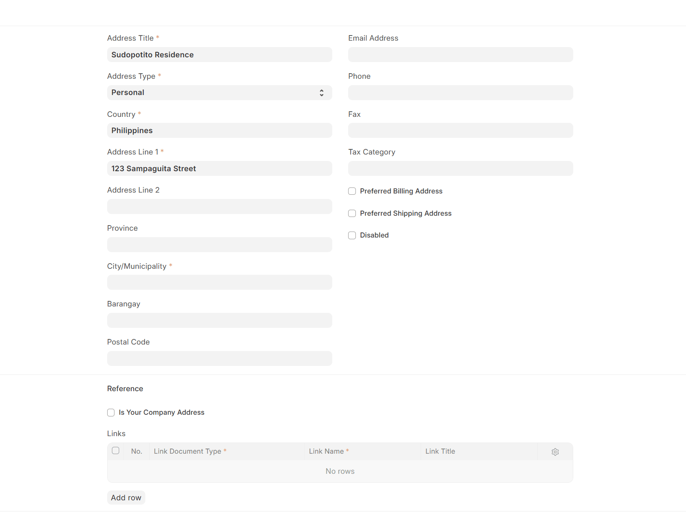

<div align="center">
  <a href="https://frappe.io">
    
  </a>

  <h1>Geo Extension</h1>
  <h4>Fast, consistent address entry for Frappe / ERPNext</h4>

   City of Iloilo > San Rafael selected step by step with the postal code filled automatically, then a United States address" width="100%" />
  <p><sub>Also available as <a href=".github/hero.mp4">hero.mp4</a>. Screenshots in <a href=".github/screenshots">.github/screenshots</a>.</sub></p>

<br><br>

</div>

---

## Overview

**Geo Extension** makes the native Frappe/ERPNext **Address** DocType behave like the address form of a modern e-commerce checkout. Instead of typing every administrative level by hand, users pick them top-down from a country's real geographic hierarchy:

```
Country → State/Province/Region → City/Municipality → Lower level → Postal code
```

Each field only offers values that belong to the selection above it, the postal code is filled in when it can be determined reliably, and the user only types the truly local part of the address (street, house number, unit, building).

It works **with** the native Address DocType, not instead of it:

- **No schema changes.** No Custom Fields, no Property Setters. The native fields (`state`, `county`, `city`, `address_line2`, `pincode`) are reused and stay plain `Data` fields.
- **Assist, never restrict.** Every field remains free text. Values that are not in the dataset are accepted, auto-filled values can be edited, unsupported countries behave exactly like stock Frappe.
- **Country-agnostic.** Hierarchies, labels, field mapping and postal-code data live in per-country datasets. Adding a country never touches Python or JavaScript.
- **Scales.** The browser only ever requests the children of the unit that was just selected; datasets are indexed once per process on the server.
- **Reusable.** The cascading selector and the API are separate from the Address integration and can be used from other DocTypes, web forms, portals and apps.

---

## Supported Countries

| Country | Code | Hierarchy (→ native field) | Records | Postal codes | Source |
| ------- | ---- | -------------------------- | ------- | ------------ | ------ |
| 🇵🇭 Philippines | `ph` | Province → `state`, City/Municipality → `city`, Barangay → `county` | 84 / 1,642 / 42,010 | 1,490 codes for 1,474 cities/municipalities | Official PSGC publication (PSA), 10-digit PSGC codes |
| 🇺🇸 United States | `us` | State → `state`, County → `county`, City → `city` | 51 / 3,143 / 20,987 | 40,690 ZIP codes | GeoNames (CC BY 4.0) |
| 🇮🇳 India | `in` | State/UT → `state`, District → `county`, City/Town → `city` | 36 / 763 / 6,941 | 18,987 PIN codes | GeoNames (CC BY 4.0) |
| 🇩🇪 Germany | `de` | Bundesland → `state`, Landkreis → `county`, City/Town → `city` | 16 / 400 / 11,419 | 10,812 codes | GeoNames (CC BY 4.0) |
| 🇮🇩 Indonesia | `id` | Province → `state`, City/Regency → `city` | 38 / 514 | 8,083 codes (per regency) | GeoNames (CC BY 4.0) |
| 🇬🇧 United Kingdom | `gb` | County/Region → `county`, City/Town → `city` | 185 / 5,707 | none (UK postcodes identify streets) | GeoNames (CC BY 4.0) |
| 🇸🇬 Singapore | `sg` | Planning Area → `city` | 55 | none (postal codes identify buildings) | URA via data.gov.sg (Open Data Licence) |

Cities and towns from GeoNames are populated places with a population of at least 500 plus every administrative seat, so small villages may be missing. Users can always type anything else. Every dataset is regenerated from its source with a script under [tools/](tools/), so refreshing data is a one-line command, not a hand edit. See [Contributing geographic data](#contributing-geographic-data).

`bench geo-extension list` prints this table for the datasets installed on your bench.

---

## How It Works

### Cascading selection

1. **Country** is moved directly below *Address Type* so it is chosen first.
2. The level fields are reordered top-down according to the country's hierarchy and relabelled with the country's own terms (e.g. *Province*, *Bundesland*, *Barangay*). Nothing is hidden.
3. Each level field gets a suggestion dropdown. Level 1 lists the top-level units; every lower level lists only the children of the unit selected above it.
4. Selecting a **different** unit at any level (or clearing the field) clears the levels below it. Free text that matches nothing is kept as typed and lower levels are left alone, so fixing a spelling by hand never wipes the rest of the address.
5. When an existing Address is opened, the stored names are resolved back to dataset units so the dropdowns continue to filter correctly. Matching ignores case and accents and also accepts a unit's **aliases** (old names and common variants such as "Iloilo City" for "City of Iloilo").
6. Changing the Country clears the level values and rebuilds the cascade for the new country.
7. The same behaviour is available in **quick-entry dialogs** (Address quick entry, ERPNext's Customer/Supplier quick entry) whenever the dialog has a country field and at least one level field.

### Native field mapping

A dataset maps each of its levels to one native Address field. Allowed targets are `state`, `county`, `city` and `address_line2`. The app does not care what a level is called; the mapping is data:

| Country | Level 1 | Level 2 | Level 3 |
| ------- | ------- | ------- | ------- |
| Philippines | Province → `state` | City/Municipality → `city` | Barangay → `county` |
| United Kingdom | County/Region → `county` | City/Town → `city` | |
| Singapore | Planning Area → `city` | | |

Levels that Frappe cannot represent are simply not included in a dataset (for example the Philippine *Region* above *Province*). `address_line2` is available as a target for countries whose lowest useful level does not fit `county`.

### Postal codes

A dataset can ship a `postal_codes.csv` that attaches one or more postal codes to any unit at any level. When the deepest selected unit changes:

- the unit's own postal codes are looked up; if it has none, its parent's are used, then the grandparent's, and so on;
- **exactly one** code → `pincode` is filled in (only if the field is empty or still holds the value the app filled in earlier);
- **several** codes → they are offered as suggestions in `pincode`; nothing is guessed;
- **none** → the field is left alone; a previously auto-filled value that no longer applies is cleared.

A postal code typed by the user is never overwritten.

### Architecture

```
 ┌──────────────────────────────────────────────────────────────┐
 │  setup/data/countries/<cc>/   manifest.json + level*.csv     │  1. data layer
 │                               [+ postal_codes.csv]           │
 └──────────────┬───────────────────────────────────────────────┘
                │  geo_extension/geo/dataset.py  (index + cache)
                │  geo_extension/geo/validate.py (validator)
 ┌──────────────▼───────────────────────────────────────────────┐
 │  geo_extension/api.py   get_hierarchy · get_options          │  2. query / API layer
 │                         resolve · get_postal_codes           │
 └──────────────┬───────────────────────────────────────────────┘
                │  HTTP (guest accessible, read only)
 ┌──────────────▼───────────────────────────────────────────────┐
 │  public/js/geo_selector.js   frappe.geo_extension            │  3. reusable selector
 │      client (cached) · GeoCascade · FormAdapter · WebFormAdapter │
 └──────────────┬───────────────────────────────────────────────┘
                │
 ┌──────────────▼───────────────────────────────────────────────┐
 │  public/js/address.js   wires GeoCascade to the Address form │  4. Address integration
 └──────────────────────────────────────────────────────────────┘
```

---

## Installation

### Requirements

- Frappe Framework v15 or v16 (developed and tested on v16). ERPNext is optional.
- Python 3.10+

### Frappe Cloud

**[Frappe Cloud](https://frappecloud.com)** hosts Frappe apps and handles installation, upgrades, monitoring and support.

<div align="left">
	<a href="https://frappecloud.com/dashboard/signup?product=geo_extension" target="_blank">
		<picture>
			<source media="(prefers-color-scheme: dark)" srcset="https://frappe.io/files/try-on-fc-white.png">
			
		</picture>
	</a>
</div>

### Bench

```bash
bench get-app https://github.com/sudopotito/geo_extension
bench --site your-site.localhost install-app geo_extension
```

That is all. Installation makes no changes to the Address DocType. Open any Address, choose a supported country and the level fields turn into cascading selectors.

### Self-hosting with the easy install script

```bash
wget https://frappe.io/easy-install.py
python3 ./easy-install.py deploy \
    --project=geo_extension_prod_setup \
    --email=your_email.example.com \
    --image=ghcr.io/sudopotito/geo_extension \
    --version=stable \
    --app=geo_extension \
    --sitename subdomain.domain.tld
```

### Upgrading from 1.x

Version 1.x changed the Address DocType (an *Autocomplete* fieldtype on `state`/`city`/`county`, a DocType-level field order and, before 1.4, a `village` Custom Field). Running `bench migrate` after updating removes all of these automatically. Values stored in the old `village` field are copied into the native `county` field where it was empty. Uninstalling the app performs the same cleanup.

The 1.x endpoints `geo_extension.geo_extension.locations.get_levels` / `get_level_options` were removed; use `geo_extension.api.get_hierarchy` / `get_options`.

---

## Geographic API

All endpoints are read-only, country-agnostic and allow guest access (geographic data is public, and website forms need it). `country` accepts a Country name (`Philippines`) or ISO code (`ph`).

| Method | Arguments | Returns |
| ------ | --------- | ------- |
| `geo_extension.api.get_hierarchy` | `country` | `{supported, country_code, levels: [{level, label, target_field}], postal_codes: {available, target_field}}` |
| `geo_extension.api.get_options` | `country, level, parent=None, txt=None, limit=None` | `[{value, label}]` children of `parent` at `level` (level 1 ignores `parent`; lower levels require it) |
| `geo_extension.api.resolve` | `country, names` (JSON list, top level first) | `[{level, value, label}]` chain of matched units, stopping at the first mismatch |
| `geo_extension.api.get_postal_codes` | `country, level, code` | `{codes: [...], level}` postal codes of the unit or its nearest ancestor that has any |
| `geo_extension.api.search` | `country, txt, level=None, limit=50` | `[{level, value, label, path: [...]}]` units at any level whose name or alias contains `txt` (2+ characters); `path` is the full chain from the top level, so one search box can fill every level |
| `geo_extension.api.get_supported_countries` | | dataset metadata for every installed country (logged-in users) |

`value` is the dataset's stable code, `label` the display name, and `aliases` (when present) the accepted alternative spellings. Names are what gets stored in Address; codes only live in the cascade.

```bash
curl "https://your-site/api/method/geo_extension.api.get_options?country=ph&level=2&parent=0603000000"
```

```python
from geo_extension import api
api.get_hierarchy("Philippines")["levels"]
api.get_options("ph", 2, parent="0603000000")      # cities and municipalities of Iloilo
api.search("ph", "san rafael")                     # -> e.g. Iloilo > City of Iloilo > San Rafael
```

Site-specific or private datasets can be added without forking the app by pointing `geo_extension_dataset_roots` in `site_config.json` at one or more directories laid out like `setup/data/countries`.

---

## Reusing the Selector

`geo_selector.js` exposes `frappe.geo_extension` and is loaded on every desk page (`app_include_js`). On website pages load it first:

```js
frappe.require("/assets/geo_extension/js/geo_selector.js");
```

Quick-entry dialogs are handled automatically by `quick_entry.js`, which attaches the cascade to any `QuickEntryForm` that has a `country` (or ERPNext's `country_address`) field plus at least one of `state`, `county`, `city`, `address_line2`. Other dialogs can call `frappe.geo_extension.attach_to_dialog(dialog)` or use `frappe.geo_extension.DialogAdapter`.

### In another desk DocType

```js
frappe.ui.form.on("Delivery Point", {
	async onload_post_render(frm) {
		frm.geo = new frappe.geo_extension.GeoCascade({
			country: frm.doc.country,
			adapter: new frappe.geo_extension.FormAdapter(frm),
			postal_field: "pincode", // optional, default "pincode"
		});
		await frm.geo.setup();
	},
	async country(frm) {
		frm.geo.teardown();
		frm.geo = new frappe.geo_extension.GeoCascade({ country: frm.doc.country, adapter: new frappe.geo_extension.FormAdapter(frm) });
		await frm.geo.setup();
	},
	state: (frm) => frm.geo.handle_change("state"),
	city: (frm) => frm.geo.handle_change("city"),
	county: (frm) => frm.geo.handle_change("county"),
});
```

The DocType must have fields named like the dataset's `target_field`s (`state`, `city`, `county`, `address_line2`) plus optionally `pincode`. Levels whose target field does not exist on the form are skipped.

### In a Web Form or custom page

`WebFormAdapter` wraps `frappe.web_form`. Any other UI can supply its own adapter object implementing `has_field`, `get_value`, `set_value`, `get_input`, `set_label`, `restore_label`, `attach_suggestions` and `detach_suggestions`, or just use the `client` methods (`get_hierarchy`, `get_options`, `resolve`, `get_postal_codes`) directly. Responses are cached in the browser per country/level/parent.

---

## Dataset Architecture

Every country is one directory under `geo_extension/setup/data/countries/<cc>/` (`cc` = lowercase ISO 3166-1 alpha-2 code, matching the *Code* of Frappe's Country record):

```
ph/
├── manifest.json      metadata, hierarchy and field mapping
├── level1.csv         code,name[,aliases]
├── level2.csv         parent_code,code,name[,aliases]
├── level3.csv         parent_code,code,name[,aliases]
└── postal_codes.csv   level,code,postal_code   (optional)
```

### Manifest

```json
{
  "country_code": "ph",
  "name": "Philippines",
  "description": "Provinces, cities/municipalities and barangays based on the PSGC.",
  "version": "1.0.0",
  "source": "https://psa.gov.ph/classification/psgc",
  "license": "…",
  "author": "Name <email> | https://…",
  "levels": [
    { "file": "level1.csv", "label": "Province", "target_field": "state" },
    { "file": "level2.csv", "label": "City/Municipality", "target_field": "city" },
    { "file": "level3.csv", "label": "Barangay", "target_field": "county" }
  ],
  "postal_codes": { "file": "postal_codes.csv", "pattern": "^[0-9]{4}$" }
}
```

- `levels` are ordered top-down; each level's rows reference the previous level through `parent_code`. Up to 6 levels are supported.
- `target_field` must be one of `state`, `county`, `city`, `address_line2` and may be used once per dataset.
- `postal_codes` is optional. `pattern` is an optional regular expression used to validate the file.
- Codes are the stable identifiers (use official codes when they exist). Names are display only, so a renamed city is a one-cell change.
- The optional `aliases` column holds `|`-separated alternative spellings (old names, "X City" for "City of X"). They are accepted on input and searchable, but never displayed.

### Regenerating a dataset

Shipped datasets are produced by scripts under [tools/](tools/) and never edited by hand:

```bash
# Philippines from the official PSGC publication (download the xlsx from psa.gov.ph first)
python tools/psgc/build_dataset.py PSGC-2Q-2026-Publication-Datafile.xlsx --out geo_extension/setup/data/countries \
    --postal-zip .work/zip/PH.zip          # optional: GeoNames postal codes

# Any country configured in tools/geonames/countries.json (downloads GeoNames automatically)
python tools/geonames/build_dataset.py us de --out geo_extension/setup/data/countries

# Singapore planning areas from data.gov.sg
python tools/datagovsg/build_dataset.py --out geo_extension/setup/data/countries
```

Adding a country that GeoNames covers well is a matter of adding an entry to `countries.json` (which GeoNames levels map to which native fields) and running the script. Prefer an official source when one is downloadable; the PSGC and Singapore scripts show the pattern.

### Validation

```bash
bench geo-extension validate               # every shipped dataset
bench geo-extension validate ph in         # specific countries
bench geo-extension validate --path ./template/xx --strict
python -m geo_extension.geo.validate       # same, without a bench (used in CI)
```

The validator reports, with file and line numbers: missing or malformed manifest properties, invalid or duplicate `target_field`s, unknown country codes, missing CSV columns, missing or invalid codes and names, duplicate codes, unknown parent references (orphans), self references, duplicate names under one parent, ambiguous aliases, units without children (partial coverage), invalid postal levels/codes/patterns and duplicate postal rows. Errors fail the command; warnings only fail with `--strict`.

The same checks run in the test suite and in CI for every shipped dataset.

---

## Contributing Geographic Data

Adding or improving a country needs no Frappe knowledge:

1. Copy `template/xx/` to `geo_extension/setup/data/countries/<cc>/`, or generate the directory with one of the [tools/](tools/) scripts.
2. Describe the hierarchy and the native field mapping in `manifest.json`.
3. Fill the level CSV files (and `postal_codes.csv` if reliable data exists).
4. Declare `source`, `license` and `author`.
5. Run `bench geo-extension validate <cc>` and `bench --site <site> run-tests --app geo_extension`.
6. Open a pull request using the dataset template.

The step-by-step guide with file formats is in [template/README.md](template/README.md).

---

## Development

### Docker

```bash
mkdir geo_extension && cd geo_extension
wget -O docker-compose.yml https://raw.githubusercontent.com/sudopotito/geo_extension/develop/docker/docker-compose.yml
wget -O init.sh https://raw.githubusercontent.com/sudopotito/geo_extension/develop/docker/init.sh
docker compose up -d
```

Visit http://geo_extension.localhost:8000 (Administrator / admin).

### Bare metal

```bash
bench init frappe-bench && cd frappe-bench
bench new-site geo_extension.localhost
bench get-app https://github.com/sudopotito/geo_extension
bench --site geo_extension.localhost install-app geo_extension
bench start
```

### Tests and linters

```bash
bench --site geo_extension.localhost set-config allow_tests true
bench --site geo_extension.localhost run-tests --app geo_extension   # Python: engine, validator, API, install, Address
node --test "tests/js/test_*.js"                                      # JavaScript: cascade rules, postal behaviour, caching
pre-commit run --all-files
```

The dataset engine and validator tests run without a site (`python -m unittest geo_extension.tests.test_dataset geo_extension.tests.test_validate`); CI runs those, the JavaScript tests and the validator for every shipped dataset on each pull request.

---

## Known Limitations

- GeoNames-based datasets list populated places with at least 500 inhabitants plus administrative seats; smaller villages are missing and their names follow GeoNames conventions. Postal codes from GeoNames are attached to a city only when the postal place name matches; otherwise to the county/district, where they appear as suggestions.
- The Philippines lists highly urbanised cities under the province they lie in (PSA codes them without a province) and Manila's barangays directly under the City of Manila. Postal codes cover 1,474 of 1,642 cities/municipalities; Manila's district-level codes are not included.
- No postal codes for the United Kingdom and Singapore, where a postcode identifies a street or building rather than an area.
- Datasets are shipped with the app; updating data means updating the app (or using `geo_extension_dataset_roots`).
- A name edited by hand that matches neither a name nor an alias ends the cascade at that level, by design.
- `WebFormAdapter` follows the Web Form client API but has not been exercised by automated tests.
- Frappe v15 support is verified by importing the app and running the site-independent tests against v15; the full suite and browser checks ran on v16.

---

## License

GNU General Public License v3.0. See [LICENSE](LICENSE).
